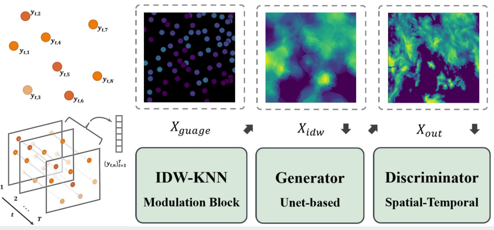

## Points to images: deep-learning enhanced spatial-temporal rainfall modeling from point measurements.

P2I-GAN is a deep generative framework that treats rainfall interpolation as a video inpainting task, enabling reconstruction of spatio-temporal rainfall fields from highly sparse and irregular rain-gauge observations.
This repository provides training scripts, data preprocessing workflows, visualization tools, and evaluation utilities so researchers can rapidly experiment with point-to-image reconstruction using an open-source benchmark.

⭐ If P2IGAN is helpful to your projects, please help star this repo. Thanks! 🤗

---

</div>

## Update
- **2026.01.16**: Our code and model are publicly available. 🐳 < planing, hope I got this.
- **2025.12.24**: The training pipelines are updated.
- **2025.12.06**: This repo is created.


### TODO
- [x] I got this in my mind. believe me.
- [x] add DK, STDK model and train.
- [x] transfer the training into zarr
- [x] make dataload be able to load the zarr dataset.
- [x] make inference code and be able to export zarr.

- [ ] make evaluation code.
- [ ] add zarr discription in fix readme
- [ ] make model output with emsemble.
- [ ] make model output with KAN
- [ ] make model output with DEUCE v1.0 framework (for uncertainty)


## Results

#### 👨🏻‍🎨 Radar-Input
<table>
<tr>
   <td> 
      
   </td>
   <td> 
      
   </td>
</tr>
</table>

#### 🎨 Gauge Input
<table>
<tr>
   <td> 
      
   </td>
   <td> 
      
   </td>
</tr>
<tr>
   <td> 
      
   </td>
   <td> 
      
   </td>
</tr>
</table>


## Overview



## Dependencies and Installation

1. Clone Repo

   ```bash
   git clone https://github.com/NTU-CompHydroMet-Lab/P2I-GAN-benchmark
   ```

2. Create Conda Environment and Install Dependencies

   ```bash
   # install uv if it is not already available
   pip install -U uv
   
   # direct to project folder
   cd P2I-GAN-benchmark

   # create and activate a local virtual environment
   uv venv .venv
   source .venv/bin/activate

   # install project dependencies from pyproject.toml / uv.lock
   uv pip install -e .
   uv sync
   ```
 
## Get Started
### Prepare pretrained models
Download our pretrained models from [Releases V0.1.0](https://github.com/sczhou/ProPainter/releases/tag/v0.1.0) < need to change in the future

The directory structure will be arranged as:
```
weights
   |- P2IGANv0.1.0.pth
   |- README.md
```

### Inference with Fake Data

Since we cannot share the original Nimrod (radar) or MIDAS (gauge) datasets with you, we provide a small fake dataset instead. You can just use code here to see the result.

```bash
python scripts/infer.py \
  --config p2igan_bench/config/p2igan_baseline_eval.json \
  --experiment-name p2igan-eval-fakedata
```

## Dataset preparation

The training and test are split into two different path with h5 files inside, with shape (HxWxT = 128x128x16).
In our research, we use Nimrod (radar) or MIDAS (gauge), please use your own dataset here.
The `datasets` directory structure will be arranged as: (**Note**: please check it carefully)

```
datasets
   |- train
      |- 201601011320.h5
      |- 201601020600.h5
   |- test
      |- 201601010000.h5
      |- 201601010320.h5
   |- test
      |- event1.h5
      |- event2.h5
```

## Training
Our training configures are provided in [`p2igan_baseline.json`](./p2igan_bench/configs/p2igan_baseline.json) 

Run one of the following commands for training:
```shell
 # For training P2IGAN
 python scripts/train.py --config p2igan_bench/config/p2igan_gan_v2.json

 # For monitoring in mlflow
 mlflow ui --backend-store-uri file:<project_path>/mlruns --port 5000
```

## Evaluation
Run one of the following commands for evaluation:
```shell
 # For evaluating flow completion model
 python scripts/evaluate.py --dataset <dataset_name> --config
```

## License

#### Non-Commercial Use Only Declaration
The P2IGAN is made available for use, reproduction, and distribution strictly for non-commercial purposes.

For inquiries or to obtain permission for commercial use, please consult Dr. Li-Pen Wang 

## Contact
If you have any questions about the technical issues, please feel free to reach me out at r13521608@caece.net. 

