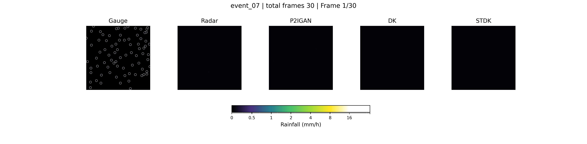
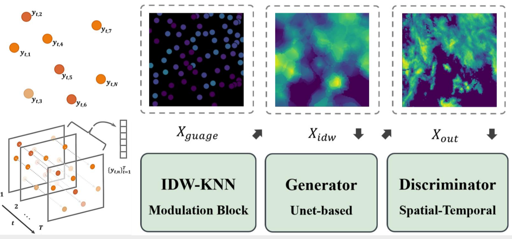

## Points to images: deep-learning enhanced spatial-temporal rainfall modeling from point measurements.

P2I-GAN is a deep generative framework that treats rainfall interpolation as a video inpainting task, enabling reconstruction of spatio-temporal rainfall fields from highly sparse and irregular rain-gauge observations.
This repository provides training scripts, data preprocessing workflows, visualization tools, and evaluation utilities so researchers can rapidly experiment with point-to-image reconstruction using an open-source benchmark.

⭐ If P2IGAN is helpful to your projects, please help star this repo. Thanks! 🤗

---

</div>

## Update
- **2026.02.10**: Our code and model are publicly available. 🐳 
- **2025.12.24**: The training pipelines are updated.
- **2025.12.06**: This repo is created.


### TODO
- [ ] make model output with emsemble.
- [ ] make model output with KAN
- [ ] make model output with DEUCE v1.0 framework (for uncertainty)


## Results

#### 👨🏻‍🎨 Radar-Input


#### 🎨 Gauge Input





## Overview



## Dependencies and Installation

1. Clone Repo

   ```bash
   git clone https://github.com/NTU-CompHydroMet-Lab/P2I-GAN-benchmark
   ```

2. Create Conda Environment and Install Dependencies

   ```bash
   # install uv if it is not already available
   pip install -U uv
   
   # direct to project folder
   cd P2I-GAN-benchmark

   # create and activate a local virtual environment
   uv venv .venv
   source .venv/bin/activate

   # install project dependencies from pyproject.toml / uv.lock
   uv pip install -e .
   uv sync
   ```
 
## Get Started
### Prepare pretrained models
Download our pretrained models from [Releases V0.1.0](https://drive.google.com/file/d/1oPkmll4_5NlkVTdDr57Bhr4UbWi-Fruw/view?usp=drive_link)

The directory structure will be arranged as:
```
weights
   |- test
      |- P2IGANv0.1.0.pt
```

### Inference with Fake Data

Since we cannot share the original Nimrod (radar) or MIDAS (gauge) datasets with you, we provide a small fake dataset instead. You can just use code here to see the result.

```bash
python scripts/infer.py \
  --config p2igan_bench/config/p2igan_baseline_eval.json \
  --experiment-name p2igan-eval-fakedata
```

## Dataset Preparation

The training and testing datasets are stored in **separate directories**, each containing HDF5 (`.h5`) files.  
Each HDF5 file represents a single event with the following shape:

```
(H, W, T) = (128, 128, 16)
```

In our experiments, the data sources include **Nimrod (radar)** and **MIDAS (rain gauge)**.  
Users should replace these with their own datasets following the same format.

---

## HDF5 Directory Structure

```
datasets
├── train
│   ├── 201601011320.h5
│   ├── 201601020600.h5
│
├── test
│   ├── 201601010000.h5
│   ├── 201601010320.h5
│
├── test_events
│   ├── event1.h5
│   ├── event2.h5
```

Each `.h5` file must contain a dataset named `frames` with shape `(T, H, W)` or `(H, W, T)` that can be reshaped accordingly.

---

## Zarr-Based Dataset (Optional)

This project also supports **Zarr-based datasets**, which are recommended for large-scale radar or gauge data and long time series training.

Compared with HDF5, Zarr provides:
- Chunked storage
- Partial I/O
- Better scalability for sliding-window training

The Zarr format is fully compatible with the provided `Dataset` and `Dataset_ZarrTrain` implementations.

---

## Zarr Directory Structure

```
datasets
├── train.zarr
│   ├── events
│   │   ├── 20160101
│   │   │   └── frames        # (T, H, W), uint8
│   │   ├── 20160102
│   │   │   └── frames
│   │
│   ├── index
│   │   └── windows           # (N, 3) -> [event_id, start_t, length]
│   │
│   └── .zattrs
│
├── test.zarr
│   ├── events
│   │   ├── event1
│   │   │   └── frames
│   │   ├── event2
│   │   │   └── frames
│   │
│   ├── index
│   │   └── windows
│   │
│   └── .zattrs
```


---

## Zarr Data Conventions

- **frames**
  - Shape: `(T, H, W)`
  - Data type: `uint8`
  - Values are scaled to `[0, 255]` before storage

- **index/windows**
  - Shape: `(N, 3)`
  - Format: `[event_id, start_t, length]`
  - Defines temporal windows for training or evaluation

- Training and testing datasets are stored in **independent Zarr roots**
  - `train.zarr`
  - `test.zarr`

---

## Zarr Attributes

Stored in `.zattrs` at the root level:

```json
{
  "suggested_window": 20,
  "description": "Radar / gauge rainfall sequences for spatio-temporal interpolation and nowcasting"
}
```

The `suggested_window` attribute is used by `Dataset_ZarrTrain` as the default temporal window length.


## Training
Our training configures are provided in [`p2igan_baseline.json`](./p2igan_bench/configs/p2igan_baseline.json) 

Run one of the following commands for training:
```shell
 # For training P2IGAN
 python scripts/train.py --config p2igan_bench/config/p2igan_gan_baseline.json
 
 # For monitoring in mlflow
 mlflow ui --backend-store-uri file:<project_path>/mlruns --port 5000

  # For infer P2IGAN
 python scripts/infer.py --config p2igan_bench/config/p2igan_gan_baseline.json

```
<!-- 
python scripts/infer.py   --config p2igan_bench/config/p2igan_ganwopos_baseline.json   --output /home/NAS/homes/brick-10015/P2I-GAN-benchmark/datasets/infer/p2iganwopos_nimrod.zarr   --overwrite

python scripts/infer.py   --config p2igan_bench/config/p2igan_ganwopos_baseline_gauge.json   --output /home/NAS/homes/brick-10015/P2I-GAN-benchmark/datasets/infer/p2iganwopos_gauge.zarr   --overwrite -->

## Evaluation
Run one of the following commands for evaluation:
```shell
 # For evaluating flow completion model
 cd experiments
 python -m experiments.main
```
## License
This project is licensed under the MIT License — see the LICENSE file for details.

## Citation
```
@software{wang2026p2igan,
  author       = {Wang, Bing-Zhang and Wang, Li-Pen},
  title        = {P2I-GAN Benchmark: Deep Generative Framework for Spatio-Temporal Rainfall Reconstruction from Sparse Gauges},
  year         = {2026},
  version      = {0.1.0},
  publisher    = {Zenodo},
  doi          = {10.5281/zenodo.18623976},
  url          = {https://github.com/NTU-CompHydroMet-Lab/P2I-GAN-benchmark}
}
```

## Contact
If you have any questions about the technical issues, please feel free to reach me out at r13521608@caece.net. 

